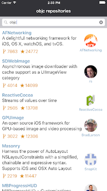
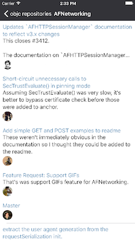
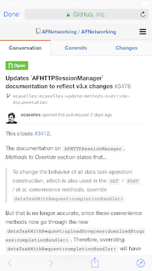

# Search the most popular repositories

This app was created for search popular repositories on GitHub and practice more about how to do tests

### Technology used in this project

* Carthage
* OCMock
* AFNetworking
* PINRemoteImage
* Unit tests
* App Universal
* GitHub API

##Contact

Follow @fabintk on Twitter or mail me at fna.contact@gmail.com.

##Licence

Days Until Seasons is available under MIT licence.
Copyright (c) 2016 Fábio Nogueira.
